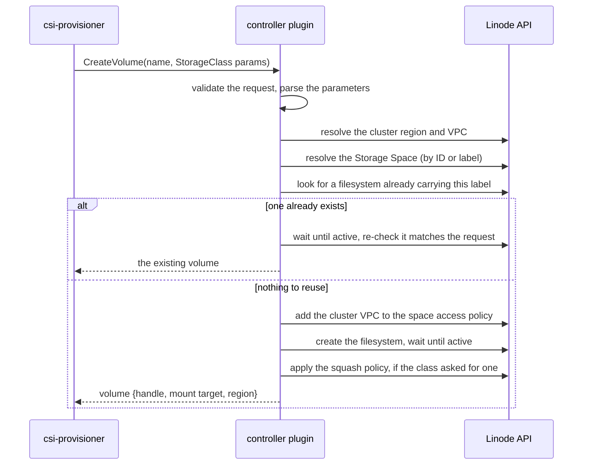
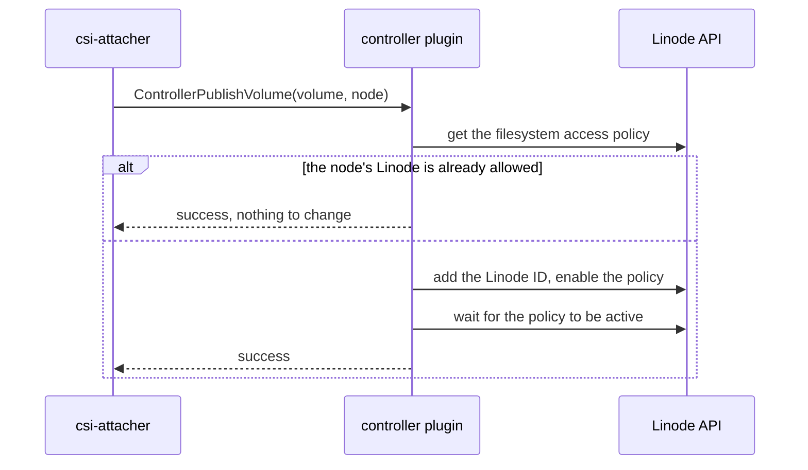
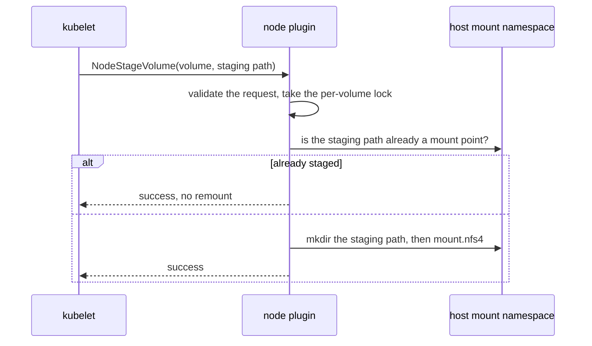

# 📐 Architecture

This page explains how the driver is put together and what happens on each code path. If you only want to install and use it, start with [Installation](./installation.md) and [Usage](./usage.md).

## 📜 Table of Contents

1. [The storage model](#-the-storage-model)
2. [Component layout](#-component-layout)
3. [Package layout](#-package-layout)
4. [The two driver roles](#-the-two-driver-roles)
5. [Volume and snapshot identity](#-volume-and-snapshot-identity)
6. [The metadata service](#-the-metadata-service)
7. [Provisioning lifecycle](#-provisioning-lifecycle)
8. [Mount lifecycle](#-mount-lifecycle)
9. [Concurrency and idempotency](#-concurrency-and-idempotency)
10. [Error mapping](#-error-mapping)
11. [Image build shape](#-image-build-shape)

## 🧱 The storage model

Linode managed NFS has three nested objects, and the driver treats each one differently.

```text
NFS Storage Space              (you create it; the driver never creates or deletes one)
├── access policy              (space-scoped: VPC ACL)
└── NFS Filesystem             (the driver creates one per PersistentVolume)
    ├── access policy          (filesystem-scoped: Linode ACL + squash policy + protocols)
    └── NFS Snapshot           (the driver creates one per VolumeSnapshot)
```

| Object | Who owns it | Maps to |
| --- | --- | --- |
| **Storage Space** | You, out of band | Referenced by every `StorageClass` |
| **Space access policy** | The driver *mutates* it | Cluster VPC attachment |
| **Filesystem** | The driver creates and deletes it | One `PersistentVolume` |
| **Filesystem access policy** | The driver mutates it | Node authorization, squash policy |
| **Snapshot** | The driver creates and deletes it | One `VolumeSnapshot` |

The important consequence: the driver is a tenant inside a space you own. It adds your cluster's VPC to the space access policy and adds individual node Linodes to each filesystem's Linode ACL, but it will not create a space for you and will not delete one. Deleting the space is always your call.

## 🧩 Component layout

One container image serves both roles. `DRIVER_ROLE` picks which gRPC services get registered.

```text
                       ┌─────────────────────────────────────────────┐
                       │            Kubernetes control plane         │
                       │   PVC / PV / VolumeAttachment / Snapshot    │
                       └───────────────────┬─────────────────────────┘
                                           │ watch + update
┌──────────────────────────────────────────┴──────────────────────────────────┐
│  Deployment: csi-linode-nfs-controller       (DRIVER_ROLE=controller)       │
│                                                                             │
│ ┌────────────────┐ ┌────────────────┐ ┌────────────────┐ ┌────────────────┐ │
│ │csi-provisioner │ │  csi-attacher  │ │  csi-resizer   │ │csi-snapshotter │ │
│ │                │ │                │ │     (off)      │ │     (off)      │ │
│ └────────┬───────┘ └────────┬───────┘ └────────┬───────┘ └────────┬───────┘ │
│          └──────────────────┴──────────────────┴──────────────────┘         │
│                    unix:///var/lib/csi/sockets/pluginproxy/csi.sock         │
│                                    │                                        │
│                        ┌───────────┴───────────┐                            │
│                        │   plugin (controller) │───────► Linode API (v4beta)│
│                        │   Identity+Controller │───────► Kubernetes API     │
│                        └───────────────────────┘                            │
└─────────────────────────────────────────────────────────────────────────────┘

                     ┌───────────────────────────┐
                     │   kubelet (on each node)  │
                     └──────▲─────────────┬──────┘
    registration, once ─────┘             └───── NodeStage / NodePublish
                            │                          │
┌───────────────────────────┼──────────────────────────┼──────────────────────┐
│  DaemonSet: csi-linode-nfs-node      (DRIVER_ROLE=node, hostNetwork: true)  │
│                           │                          ▼                      │
│      ┌────────────────────┴───┐      ┌────────────────────────┐             │
│      │ node-driver-registrar  │─────►│    plugin (node)       │             │
│      └────────────────────────┘      │    Identity + Node     │             │
│         unix:///csi/csi.sock         └───────────┬────────────┘             │
│                                                  │                          │
│                                  mount.nfs4 ◄────┤                          │
│                        Kubernetes API (nodes) ◄──┤                          │
│                  go-metadata (169.254.169.254) ◄─┘                          │
└─────────────────────────────────────────────────────────────────────────────┘
```

`node-driver-registrar` runs once, at startup: it reads the driver name off the plugin socket and writes a registration file into the kubelet's plugin directory. From then on the kubelet calls the `plugin` container directly over the same socket and the registrar does nothing further.

### Socket paths are deliberately different per role

The controller listens on `unix:///var/lib/csi/sockets/pluginproxy/csi.sock`, backed by an `emptyDir`, so it stays pod-local. The node plugin listens on `unix:///csi/csi.sock`, which is a `hostPath` at `{kubeletPath}/plugins/linodenfs.csi.linode.com/`, and registers with the kubelet at that same host path.

Keeping them separate avoids host-side contention when several CSI drivers are installed on the same node. If you change one, change the sidecar `--csi-address` flags with it.

### Why the node plugin needs privileges

`node.pluginSecurityContext` defaults to `privileged: true`, `runAsUser: 0`, `runAsGroup: 0`. Two reasons:

1. Creating `csi.sock` inside the kubelet `hostPath` directory requires root.
2. `k8s.io/utils/mount` shells out to `mount` and `mount.nfs4`, and the mounts use `mountPropagation: Bidirectional` so they are visible to pods. That rules out a distroless base image; the runtime image is `alpine` with `nfs-utils` installed.

## 📦 Package layout

```text
.
├── main.go                       # env config, klog setup, role dispatch, gRPC start
├── internal/driver/
│   ├── driver.go                 # LinodeDriver: shared state, SetupLinodeDriver, Run
│   ├── capabilities.go           # plugin / controller / node capability wiring
│   ├── identityserver.go         # GetPluginInfo, GetPluginCapabilities, Probe
│   ├── controllerserver.go       # controller RPC entry points
│   ├── controller_helpers.go     # parameter parsing, handles, Linode API orchestration
│   ├── nodeserver.go             # node RPC entry points
│   ├── nodeserver_helpers.go     # mount-point setup, NFS mount
│   ├── metadata.go               # node/cluster/VPC resolution
│   ├── server.go                 # non-blocking gRPC server, unary logging interceptor
│   └── errors.go                 # shared gRPC status errors
├── pkg/linode-client/            # LinodeClient interface + configured linodego client
├── pkg/mount-manager/            # SafeFormatAndMount wrapper
├── pkg/filesystem/               # FileSystem interface over the os package
├── pkg/util/                     # volume locks, timestamp parsing, byte helpers
├── mocks/                        # gomock doubles, regenerated by `mise run gen-mock`
├── charts/linode-nfs-csi-driver/ # source of truth for deployment manifests
├── deploy/kubernetes/            # kustomize base, rendered from the chart
└── hack/                         # update-kustomize.sh, verify-kustomize.sh
```

Two boundaries are worth calling out:

- **`pkg/linode-client` is the only Linode API boundary.** `LinodeClient` is an interface that `*linodego.Client` satisfies (`var _ LinodeClient = (*linodego.Client)(nil)`). Everything the driver needs from Linode is on that interface, which is what makes the controller unit-testable against `mocks/mock_linodeclient.go`.
- **`pkg/filesystem` and `pkg/mount-manager` are the only host boundaries.** The node server never calls `os` or `mount` directly, so node tests inject doubles instead of touching the real filesystem.

## 🎭 The two driver roles

`main.go` reads `DRIVER_ROLE` and builds only what that role needs:

| | `DRIVER_ROLE=controller` | `DRIVER_ROLE=node` |
| --- | --- | --- |
| Requires `LINODE_TOKEN` | **Yes**, startup fails with `ErrTokenRequired` without it | No |
| Linode API client | Built | `nil` |
| Mounter | `nil` | `mountmanager.NewSafeMounter()` |
| gRPC services registered | Identity + Controller | Identity + Node |
| Plugin capability advertised | `CONTROLLER_SERVICE` | *(none)* |

An unrecognized value fails fast with `invalid driver role %q`. `SetupLinodeDriver` validates the role again before wiring anything, so neither server can be constructed for the wrong role.

`Run` flips the driver's `ready` flag before serving, which is what `Probe` reports back to the `livenessprobe` sidecar.

## 🔑 Volume and snapshot identity

The Linode NFS API addresses a filesystem by *space and filesystem*, and a snapshot by *space, filesystem, and snapshot*. There is no globally unique filesystem ID in the request path the driver uses, so the CSI handles are composite:

```text
volume handle:    {space_id}/{filesystem_id}          e.g. 42/1337
snapshot handle:  {space_id}/{filesystem_id}/{snap}   e.g. 42/1337/9
```

`parseVolumeHandle` and `parseSnapshotHandle` reject anything with the wrong segment count or non-integer segments with `InvalidArgument`. Because the handle carries the space, no RPC needs to re-read the `StorageClass` to find out where a volume lives.

### Labels

The CSI volume name from `csi-provisioner` (for example `pvc-0f3a…`) becomes the filesystem label after two transformations:

1. `normalizeLabel` lowercases it. The NFS backend expects lowercase labels.
2. `truncateNFSLabelToMaxBytes` cuts it to 63 bytes, the NFS OpenAPI maximum, then strips any trailing hyphen run the cut left dangling, so `my-volume-` never reaches the API.

The same normalization applies to snapshot labels. Because the label is derived deterministically from the CSI name, a retried `CreateVolume` produces the same label and finds the existing filesystem instead of creating a second one.

## 🧭 The metadata service

`internal/driver/metadata.go` answers three questions, and deliberately uses two data sources.

| Question | Used by | Source |
| --- | --- | --- |
| Which Linode am I running on? | Node plugin, for `NodeGetInfo` | `go-metadata` fast path, Kubernetes node fallback |
| What is the cluster region and VPC? | Controller, for `CreateVolume` | Kubernetes node list, then the Linode API |
| What is the Linode ID for node *X*? | Controller, for publish/unpublish | Kubernetes node `spec.providerID` |

The controller must translate arbitrary Kubernetes node names into Linode IDs, which instance metadata cannot do (it only ever describes the local instance), so Kubernetes node objects are the primary source. `go-metadata` is used only as a local fast path on the node plugin; if the metadata service is unreachable at startup, `instanceClient` is left `nil` and everything falls back to Kubernetes lookups.

### Resolving the Linode ID

From `spec.providerID`, which the Linode CCM sets to `linode://12345`. A node without a provider ID, or with a differently-prefixed one, is an error rather than a guess.

### Resolving the region

From the node label `topology.kubernetes.io/region`, falling back to the beta label `failure-domain.beta.kubernetes.io/region`. `Cluster()` walks every node and rejects a cluster whose nodes disagree, because a filesystem is created in exactly one region.

### Resolving the VPC

This is the subtle one, and it has two code paths because Linode has two interface generations:

- **Newer `linode` interface generation:** `ListInterfaces` exposes VPC attachment directly, on the interface's `VPC.VPCID`.
- **Legacy config-profile interfaces** (which is what most existing Linodes use, including LKE and CAPL nodes): VPC attachment is a `purpose="vpc"` entry with a `VPCID` on the *active* `InstanceConfig`, so the driver lists instance configs instead.

`nodeVPCID` reads `instance.InterfaceGeneration` to decide which path to take. Either path errors if one Linode somehow reports two different VPCs, and returns `errClusterVPCNotFound` when it finds none, which `CreateVolume` surfaces as `FailedPrecondition`.

## 🔄 Provisioning lifecycle

### CreateVolume



The lookup by label is what makes this idempotent. `csi-provisioner` retries `CreateVolume` freely, and a retry after a partial failure re-finds the filesystem instead of leaking a second one. A restore from a snapshot follows the same shape, with a clone in place of the create.

Adding the VPC is a *mutation of an object you own*. The driver appends your cluster's VPC to the space access policy, preserving every VPC and subnet already in the ACL, and never removes one.

### DeleteVolume

Deliberately forgiving, because CSI requires deleting an unknown volume to succeed:

- Empty volume ID: `InvalidArgument`.
- Malformed but non-empty handle: **success**. A handle the driver cannot parse cannot name a filesystem it created, so it is an unknown volume, and the deletion has nothing to do.
- Linode returns 404: **success**. Already gone.
- Anything else: mapped Linode error.

The Storage Space is untouched.

### ControllerPublishVolume and ControllerUnpublishVolume

This driver sets `attachRequired: true`, so `csi-attacher` participates. "Attach" here means *authorize*, not *mount*:



`ControllerUnpublishVolume` is the mirror image and is idempotent in three ways: an empty node ID succeeds, a 404 on the filesystem succeeds, and a Linode that is not in the ACL succeeds. When it does remove an ID it preserves the policy's existing `enabled` value rather than forcing it.

The update always re-sends `Label`, `Enabled`, `LinodeIDs`, and `SquashPolicy` (and `Protocols` when set), because the API treats the update as a replacement of the policy.

## 🔌 Mount lifecycle

### NodeStageVolume

Stages the NFS filesystem once per node, at the kubelet staging path.



The mount source is the filesystem's DNS name, carried from the controller in the volume context under `mount-target`; a request without it fails with `InvalidArgument`. The filesystem type is always `nfs4`.

### NodePublishVolume

Bind-mounts the staged path into the pod's target path with `-o bind`, plus the capability's mount flags, plus `ro` when the request is read-only. On mount failure it cleans up and returns `Internal`.

The lock here is on the **target path**, not the volume ID. Many pods on one node can share a single NFS volume, and serializing them on the volume ID would make them queue behind each other for no reason.

### NodeUnstageVolume and NodeUnpublishVolume

Both call `mount.CleanupMountPoint(path, mounter, true)`, which unmounts and removes the leftover directory, and both are safe to repeat. Unstage locks the volume ID; unpublish locks the target path, matching their publish counterparts.

### NodeGetVolumeStats

Calls `statfs(2)` on the volume path and reports both byte and inode usage. `ENOENT` becomes `NotFound`; every other error, including the `EIO` you get from a filesystem that is no longer mounted, becomes `Internal`.

## 🔒 Concurrency and idempotency

`pkg/util/volume_lock.go` is a mutex-guarded string set. `TryAcquire` does not block: if the key is held, the RPC returns `Aborted` with `VolumeOperationAlreadyExistsFmt` and the sidecar retries later. This is the standard CSI pattern, and it keeps a slow operation from pinning a gRPC worker.

Which key each RPC locks:

| RPC | Lock key | Why |
| --- | --- | --- |
| `CreateSnapshot` | volume ID | One snapshot operation per source filesystem |
| `NodeStageVolume` | volume ID | One stage per volume per node |
| `NodeUnstageVolume` | volume ID | Mirrors stage |
| `NodePublishVolume` | target path | Pods sharing a volume must not serialize |
| `NodeUnpublishVolume` | target path | Mirrors publish |

Note that the locks are per-process. The controller runs with `--leader-election` on its sidecars, so only one controller acts at a time; the node locks only ever need to cover one node's kubelet.

Every long-running Linode operation is wrapped in `waitContext`, a 5 minute `context.WithTimeout`. A wait that outlives it returns `DeadlineExceeded` rather than hanging, and the sidecar retries.

## 🚨 Error mapping

The gRPC codes the driver returns follow the [CSI specification](https://github.com/container-storage-interface/spec/blob/master/spec.md), which defines, per RPC, which codes a plugin may return and how a caller is expected to react to each one. Read the spec's table for the RPC you are looking at when you need to know whether a particular failure is retried.

`linodeError` is the other half: it translates Linode HTTP status codes into those gRPC codes, which is what decides whether a sidecar retries, gives up, or surfaces a permanent failure on the PVC:

| Linode response | gRPC code | Effect |
| --- | --- | --- |
| 404 | `NotFound` | Treated as success by delete paths |
| 400, 422 | `InvalidArgument` | Permanent; fix the request |
| 401, 403 | `PermissionDenied` | Check the token's scope |
| 409 | `FailedPrecondition` | State conflict |
| 429, 502, 503, 504 | `Unavailable` | Retried |
| anything else | `Internal` | Retried |

`linodeWaitError` adds the two context cases on top, mapping `context.Canceled` to `Canceled` and `context.DeadlineExceeded` to `DeadlineExceeded` before deferring to `linodeError`.

## 🐳 Image build shape

Images are built with a multi-stage `Dockerfile`.

- The builder stage compiles a static binary with `CGO_ENABLED=0 -trimpath` and stamps `main.vendorVersion` from the `REV` build arg.
- The runtime stage is `alpine:3.23.3` plus `ca-certificates` and `nfs-utils`, so the node plugin can exec `mount` and `mount.nfs4`.
- `mise run image-build` builds for `PLATFORM`, default `linux/amd64`.
- `IMAGE_REPO=... IMAGE_VERSION=... mise run image-push` publishes that image.

Controller and node share one image and one entrypoint; `DRIVER_ROLE` selects the process behavior.

## 📚 Related pages

- [Access and Networking](./access-and-networking.md) for the VPC, ACL, and squash details
- [Configuration Reference](./configuration-reference.md) for every environment variable and Helm value
